#  3MF Slice Extension

## Specification & Reference Guide


| **Version** | 1.0.2 |
| --- | --- |
| **Status** | Published |

## Disclaimer

THESE MATERIALS ARE PROVIDED "AS IS." The contributors expressly disclaim any warranties (express, implied, or otherwise), including implied warranties of merchantability, non-infringement, fitness for a particular purpose, or title, related to the materials. The entire risk as to implementing or otherwise using the materials is assumed by the implementer and user. IN NO EVENT WILL ANY MEMBER BE LIABLE TO ANY OTHER PARTY FOR LOST PROFITS OR ANY FORM OF INDIRECT, SPECIAL, INCIDENTAL, OR CONSEQUENTIAL DAMAGES OF ANY CHARACTER FROM ANY CAUSES OF ACTION OF ANY KIND WITH RESPECT TO THIS DELIVERABLE OR ITS GOVERNING AGREEMENT, WHETHER BASED ON BREACH OF CONTRACT, TORT (INCLUDING NEGLIGENCE), OR OTHERWISE, AND WHETHER OR NOT THE OTHER MEMBER HAS BEEN ADVISED OF THE POSSIBILITY OF SUCH DAMAGE.

## Table of Contents

- [Preface](#preface)
  * [About this Specification](#about-this-specification)
  * [Document Conventions](#document-conventions)
  * [Language Notes](#language-notes)
  * [Software Conformance](#software-conformance)
- [Part I: 3MF Documents](#part-i-3mf-documents)
- [Chapter 1. Introduction](#chapter-1-introduction)
  * [Package Organization and OPC Compliance](#package-organization-and-opc-compliance)
  * [Slice Extension Additions Overview](#slice-extension-additions-overview)
  * [Slice Data Processing Rules](#slice-data-processing-rules)
- [Chapter 2. Resources](#chapter-2-resources)
  * [Object](#object)
  * [Slicestack](#slicestack)
- [Chapter 3. Slice](#chapter-3-slice)
  * [Vertices](#vertices)
  * [Polygon](#polygon)
- [Part II. Appendixes](#part-ii-appendixes)
  * [Appendix A. Glossary](#appendix-a-glossary)
  * [Appendix B. 3MF XSD Schema](#appendix-b-3mf-xsd-schema)
  * [Appendix C. Standard Namespaces and Content Types](#appendix-c-standard-namespaces-and-content-types)
- [References](#references)

# Preface

## About this Specification

This 3MF slice specification is an extension to the core 3MF specification. This document cannot stand alone and only applies as an addendum to the core 3MF specification. Usage of this and any other 3MF extensions follow an a la carte model, defined in the core 3MF specification.

Part I, "3MF Documents," presents the details of the primarily XML-based 3MF Document format. This section describes the XML markup that defines the composition of 3D documents and the appearance of each model within the document.

Part II, "Appendixes," contains additional technical details and schemas too extensive to include in the main body of the text as well as convenient reference information.

The information contained in this specification is subject to change. Every effort has been made to ensure its accuracy at the time of publication.

This extension MUST be used only with Core specification 1.x.

## Document Conventions

See [the 3MF Core Specification conventions](https://github.com/3MFConsortium/spec_core/blob/master/3MF%20Core%20Specification.md#document-conventions).

In this extension specification, as an example, the prefix "s" maps to the xml-namespace "http://schemas.microsoft.com/3dmanufacturing/slice/2015/07". See Appendix [C.3 Namespaces](#c3-namespaces).

## Language Notes

See [the 3MF Core Specification language notes](https://github.com/3MFConsortium/spec_core/blob/master/3MF%20Core%20Specification.md#language-notes).

## Software Conformance

See [the 3MF Core Specification software conformance](https://github.com/3MFConsortium/spec_core/blob/master/3MF%20Core%20Specification.md#software-conformance).

# Part I: 3MF Documents

# Chapter 1. Introduction

This document describes new elements and attributes to support the inclusion of sliced model data in a 3MF package.

The Slice Extension allows models to be stored as stacks of 2D slices alongside the 3D meshes of the core specification. In this way lower-level printer data can be stored in the 3MF package. These slices also allow for the specification of materials and properties on the polygons and line segments that make up individual slices. Since the sliced data is potentially quite large, we allow that data to be moved into separate xml documents in the package for easier parsing.

As highlighted in later sections, the underlying concept of 3mf extensions is to maintain a fallback possibility to the core specification for consumers not able to handle slice data.

The 3MF Slice extension allows a producer to store slices either in the root model part or in other model files in 3MF packages. This structural approach enables three primary advantages for producers and consumers of 3MF packages with large amounts of data:

- The build directive in the root model file can be parsed by consumers without having to parse any actual model data.
- The original mesh objects can be sliced, and all the new data is additional, requiring little change to the original model file, with the referenced slices existing in separate files in the package.
- Parsing the model objects from individual XML files will often require fewer resources than parsing a monolithic model file that could be more than 500MB in size.

The root model part MAY have relationships to other model parts, whose \<slicestack> resources can be referenced by the parent model stream using the additional attributes within \<object> elements.

## Package Organization and OPC Compliance

For package readability and organization, slice models SHOULD be stored in the 2D folder UNLESS they are part of the root model part. This means that, except in the root model part, all 3D and slice model data SHOULD be separated into different physical folders in the 3MF package.

To maintain OPC compliance, slice model data (outside of the root model file) must be referenced from the source model part relationship file. For example, if a slice model file (slices1.model) is being referenced from the root model file (3dmodel.model), then there MUST be a /3D/\_rels/3Dmodel.model.rels file containing the relationships to the slice files:

```xml
<?xml version="1.0" encoding="UTF-8"?>
<Relationships xmlns="http://schemas.openxmlformats.org/package/2006/relationships">
  <Relationship Target="/2D/slices1.model" Id="rel100" Type="http://schemas.microsoft.com/3dmanufacturing/2013/01/3dmodel" />
</Relationships>
```

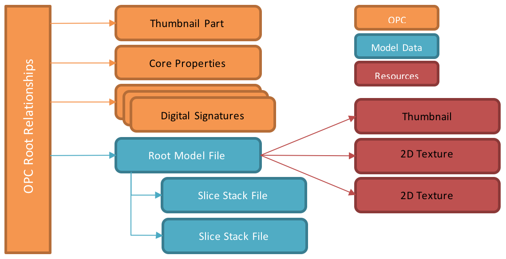
_Figure 1–1. A typical production 3MF Document with multiple slice stack streams_

## Slice Extension Additions Overview

_Figure 1-2: Overview of 3MF Slice Extension XML structure_

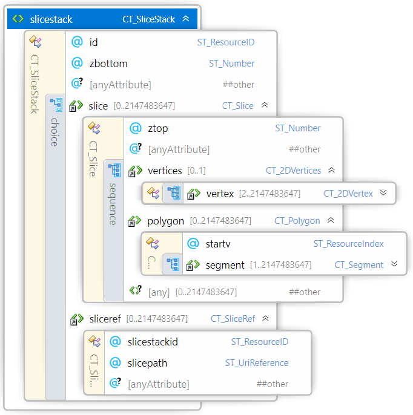

There are additions to the 3MF core specification in the Slice Extension. Each will be detailed by where it fits into the existing core 3MF constructs.

Figures 1-3 and 1-4 together comprise an example of the slice extension in use.


```xml
<?xml version="1.0" encoding="utf-8"?>
<model unit="millimeter" lang="en-US" xmlns="http://schemas.microsoft.com/3dmanufacturing/core/2015/02"
xmlns:s="http://schemas.microsoft.com/3dmanufacturing/slice/2015/07" requiredextensions="s">
  <resources>
    <s:slicestack id="1" zbottom="0.000">
      <s:sliceref slicestackid="1" slicepath="/2D/8cb173a3-7ed9-40f2-b3f1-ef4e4aefcc.model" ztop="2.000" />
    </s:slicestack>
    <object id="2" name="TestModel" s:meshresolution="lowres" s:slicestackid="1">
      <mesh>
        <!-- mesh content here -->
      </mesh>
    </object>
  </resources>
  <build>
    <item objectid="2" transform="1.0000 0.0000 0.0000 0.0000 1.0000 0.0000 0.0000 0.0000 1.0000 0.0000 0.0000 0.0000" />
  </build>
</model>
```

_Figure 1-3: Example of referencing Slice Extension structure in core 3MF model._

In this example, object id 2 is referenced from the single \<build>\<item> element. The 3MF Core specification expressly states that each object must contain a mesh representation. The geometry of that mesh would be encoded within the \<object>\<mesh> element. Object id 2 then references slicestack id 1. The \<slicestack> element can either contain actual slice data or one or more \<sliceref> elements to reference slice content from separate model parts within the 3MF container. See figure 1-4.

```xml
<?xml version="1.0" encoding="utf-8"?>
<model xmlns="http://schemas.microsoft.com/3dmanufacturing/core/2015/02" 
xmlns:s="http://schemas.microsoft.com/3dmanufacturing/slice/2015/07" unit="millimeter" xml:lang="en-US">
  <resources>
    <s:slicestack id="1" zbottom="0.000">
      <s:slice ztop="0.100">
        <s:vertices>…
        <s:polygon startv="0">…
        </s:polygon>
      </s:slice>
      <s:slice ztop="0.100">
        <s:vertices>
        <s:polygon startv="0">
        </s:polygon>
      </s:slice>
    </s:slicestack>
  </resources>
  <build>
  </build>
</model>
```

_Figure 1-4: Example of referenced Slice Extension structure in core 3MF model_

This is a \<sliceref> example where the actual slice contents reside in a separate model part from the source \<slicestack> element. Note that in this case, the \<build> element is empty and there is no \<object> element.

The \<resources> element in any 3MF model file MAY contain slice model data in one or more \<slicestack> elements. In the case that \<slicestack> data exists in a separate file from the referencing \<object>, the \<slicestack> data can stand alone in that file as long as the core 3MF requirement for a mesh representation of an object exists in the 3MF package.

\<slicestack> elements are referenced from an \<object>, which is referenced from a \<build>\<item>. Slice data is ALWAYS coupled with the \<object> with which it is associated and NEVER directly from a \<build>\<item>.

The \<slicestack> element encapsulates all slice data and references to materials and properties following the same approach as core 3MF meshes. All slice model data is made up of vertices, polygons, and line segments as defined below.

Within the core \<object> element, slice data is incorporated in the following ways:

1. slicestackid Attribute: The slicestackid attribute references a \<slicestack> element either in the current model part or in another model part in the 3MF package (see the slicepath attribute).
2. slicepath Attribute: If the slice model data is contained in a separate model OPC part from the referencing \<object> element, then slicepath and slicestackid attributes are combined to reference the slice data. In this case, for the model part containing the referenced slice data, there MUST exist an OPC relation to the model stream as described in section 2.
3. meshresolution Attribute: Mesh representations are a REQUIRED part of the core 3MF specification, but encoding both a full-resolution mesh and slice data in the same package can generate large packages. To alleviate this potential file size problem, there is the option to include lower-resolution meshes in the package as long as consumers are notified that the included meshes are not intended to be used to drive fabrication or detailed visualization use cases. The "meshresolution" attribute is used to describe the nature of an \<object> element. If the mesh resolution is "lowres", the 3MF document MUST list the slice extension in the requiredextension attribute of the model section (see [paragraph 3.4](https://github.com/3MFConsortium/spec_core/blob/master/3MF%20Core%20Specification.md#34-model) of the core specification).

The \<build> element has a single change for slice data:

1. Transforms: If an object references slice model data, the 3D transform matrices in \<build>\<item> and \<component> elements are limited to those that do not impact the slicing orientation (planar transformations). Therefore, any transform applied (directly or indirectly) to an object that references an \<slicestack> MUST have m02, m12, m20, and m21 equal to* (see below) zero and m22 equal to one (see [chapter 3.3](https://github.com/3MFConsortium/spec_core/blob/master/3MF%20Core%20Specification.md#33-3d-matrices) of the core specification). Resulting transformation matrices will therefore have the following form:

| m00 | m01 | 0.0 | **0.0** |
| --- | --- | --- | --- |
| m10 | m11 | 0.0 | **0.0** |
| 0.0 | 0.0 | 1.0 | **0.0** |
| m30 | m31 | m32 | **1.0** |

\* Equal to in this context MUST NOT be defined in a floating point sense (e.g. with epsilon tolerances), but always interpreted the following way:

1. Producers MUST NOT output other transformation string values than "0", "0." or "0.0" with an arbitrary amount of trailing zeros for m02, m12, m20, and m21.
2. Producers MUST NOT output other transformation string values than "1", "1." or "1.0" with an arbitrary amount of trailing zeros for m22.

This specifically excludes signs and scientific representations in order to keep the planar transformations efficient, reproducible, easy to implement and without special corner cases.

## Slice Data Processing Rules

Sliced model data extends the core 3MF mesh format's geometrical representation of objects to include vector-based layers. Creation of sliced model data is OPTIONAL for producers, but MUST be supported by consumers that specify support for the 3MF Slice Extension. If such a consumer receives a 3MF package including slice extension content, it must be able to process it. The consumer can choose to process and use the included mesh representation in addition to, or instead of, slice data. Consumers should be aware that if the mesh representation is tagged as "lowres", the accuracy of the actual mesh might not be as rich as the attached slice data.

3MF consumers that do not claim support for the Slice Extension have no responsibility to parse or otherwise process sliced model data.

All slice models are referenced from \<object> elements. The reference can be within the same model file as the \<object> or from a different file in the same 3MF package. As defined in the 3MF Core Specification, all valid 3MF packages MUST contain a mesh representation of all models in the package. In order to balance the need for a guaranteed core representation with the need to be space efficient with 3MF packages, producers can choose to include different resolutions for the mesh models included when slice models are the primary representation in the package. The meshresolution attribute at the \<object> level indicates the relative resolution of the mesh.

There is a single transform for each build item. If both 2D slice and 3D mesh models are included in the 3MF package, the item transform is limited according to the transforms section in Chapter 3. This limitation ensures that the models are arranged in a consistent manner for both slice and mesh representations when they are both used.

# Chapter 2. Resources

Element **\<resources>**

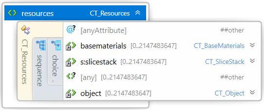

The \<slicestack> element encapsulates slice data. Unlike \<object> elements, \<slicestack> elements MUST NOT be referenced directly from \<build> items. Instead, they are referenced from \<object> elements to ensure that object positions are maintained for both 3D and 2D content.

## Object

Element **\<object>**

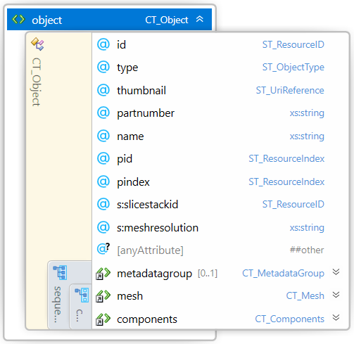

##### Attributes

| Name | Type | Use | Default | Annotation |
| --- | --- | --- | --- | --- |
| slicestackid | **ST\_ResourceID** | required | | Identifies the \<slicestack> that contains the slice data for the specified object. If used alone, the slice data exists in the same file as the object. If used in conjunction with the slicepath attribute, the slice data resides in the target file under the specified id. |
| meshresolution | **xs:string** | optional | fullres | Indicates the intended use of mesh models contained in a 3MF package when slice models are present. |

*All other attributes exist in 3MF Core Specification.

In order to reference slice data, there are two additional attributes for \<object> elements:

* "_slicestackid"_: An identifier for the model data contained within a \<slicestack> object. The identifier MUST be unique in the 3MF package. If slicestackid is used in conjunction with the slicepath attribute, slicestackid references that slicestack id in the specified file in the 3MF package.
* "_meshresolution"_: An enumerated description of the mesh that is included in the 3MF package. meshresolution gives consumers a hint about how the mesh data in the 3MF package is intended to be used when slice data is also present. Valid options are:
  * "_fullres"_: The included mesh data is "full resolution" and could be used to re-generate the slices contained in the 3MF package.
  * "_lowres"_: The included mesh is not sufficiently accurate to re-generate the slices contained in the 3MF package.

A 3MF package containing "lowres" objects MUST list the slice extension in the requiredextensions property of the model section (see [chapter 1](https://github.com/3MFConsortium/spec_slice/blob/master/3MF%20Slice%20Extension.md#chapter-1-introduction)).

The slicestack MIGHT be defined on a components object providing a slicestack for the combined components or on a referenced object. When the slicestack is defined in both types of objects, the slicestack that prevails MUST be the one at the components level.

## Slicestack

Element **\<slicestack>**

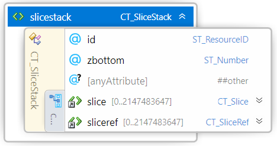

##### Attributes

| Name | Type | Use | Default | Annotation |
| --- | --- | --- | --- | --- | 
| id | **ST\_ResourceID** | required | | Defines the unique identifier for this object. The slicestack ID must be unique within the entire 3MF package, but just within a single model part. |
| zbottom | **ST\_Number** | optional | 0 | The starting level (in specified model units) relative to build platform. |

A \<slicestack> element is referenced from the \<object> element and defines an object by a stack of slices instead of a mesh. The slices in the \<slicestack> element can then be stored in one or more separate files per sliced object using the sliceref element.

The zbottom attribute in slicestack indicates where on the z axis that slices should start relative to the build platform. This allows the producer to align the bottom of a sliced part with the mesh vertices of a mesh representation in the same 3MF package.

The \<sliceref> element is described in the following subsection, while the more complicated \<slice> element gets its own treatment in Chapter 3.

### SliceRef

Element **\<sliceref>**

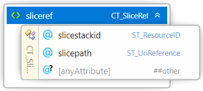

##### Attributes

| Name | Type | Use | Default | Annotation |
| --- | --- | --- | --- | --- |
| slicestackid | **ST\_ResourceID** | required | | Identifies the \<slicestack> that contains the slice data for the specified object. |
| slicepath | **ST\_UriReference** | required | | An absolute path to a non-root model file in the 3MF package that contains slice data in \<slicestack> objects. |

Instead of supplying \<slice> elements inside a slice stack, it is also possible to use \<sliceref> elements to include a single slice (or multiple slices at once) from another model stream. Slice Stacks may either contain \<slice> elements or \<sliceref> elements, but they MUST NOT contain both element types concurrently.

The referenced slice stack has to live in a related OPC part, identified by the "slicepath" URI. The following rules apply:

- The OPC part of the referenced slice stack MUST be different than the model stream of the original slice stack.
- The OPC part of the referenced slice stack MUST be related to the model stream of the original slice stack.
- A referenced slice stack MUST NOT contain any further \<sliceref> elements – there can be only a single layer of abstraction from the original \<slicestack> to the slice contents.

All three rules avoid circular references or unwanted structural complexity.

At the interface between adjacent sliceref elements, the last ztop of the first referenced slicestack SHOULD be equal to the zbottom of the next referenced slicestack, however in the event they are different, consumers MUST ignore zbottom and use the previous ztop instead. The first ztop in the next slicestack MUST be greater than the last ztop in the previous slicestack, in keeping with monotonically increasing height.

# Chapter 3. Slice

Element **\<slice>**

The \<slice> element is the 2D companion to the \<mesh> element from the core specification. It is comprised of one \<vertices> and one or more \<polygon> elements that describe the polygons of the slice to be printed. A \<slice> can exist that contains no geometry for a variety of reasons. If an object slice is completely void of content, it MUST still be represented with a \<slice> element which ONLY contains a ztop reference to establish the vertical space which the void occupies. If a \<slice> element contains any geometry, then it must adhere to the requirements specified below.

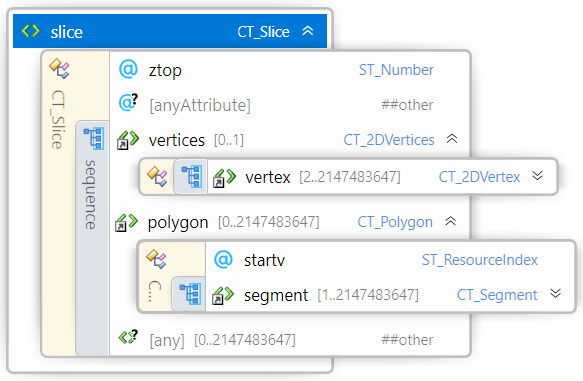

##### Attributes

| Name | Type | Use | Default | Annotation |
| --- | --- | --- | --- | --- |
| ztop | **ST\_Number** | required | | Allows a slice to have an arbitrary thickness defined as an z-position of the top of the slice relative to the build platform. ztop MUST be always monotonically increasing throughout the slice stack. |

## Vertices

Element **\<vertices>**

The \<vertices> element contains all the \<vertex> elements for this object. Vertices represent the points of the polygons within the slice. The order of these elements defines an implicit 0-based index that is referenced by other elements, such as the \<segment> element. If the \<slice> contains content, the \<vertices> element MUST exist and all downstream rules apply. The producer SHOULD collapse vertices that are very closely proximal with a single vertex. In order to avoid integer overflows, a vertex array MUST contain less than 2^31 vertices.

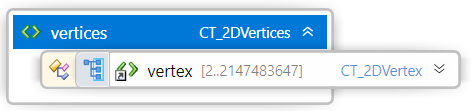

### Vertex

Element **\<vertex>**

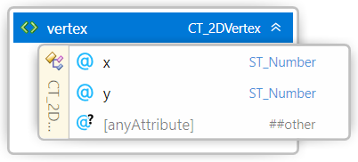

##### Attributes

| Name | Type | Use | Default | Annotation |
| --- | --- | --- | --- | --- |
| x | **ST\_Number** | required | | The position of the vertex along the X axis. |
| y | **ST\_Number** | required | | The position of the vertex along the Y axis. |

A \<vertex> element represents a point in 2-dimensional space that is referenced by a segment in the slice. The decimal values representing the coordinates can be recorded to arbitrary precision. The precision used should be no higher than that expected from the producer's calculations.

In order to avoid integer overflows, a \<vertices> element MUST contain less than 2^31 \<vertex> elements.

## Polygon

Element **\<polygon>**

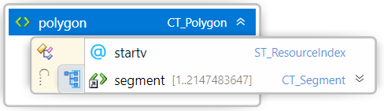

##### Attributes

| Name | Type | Use | Default | Annotation |
| --- | --- | --- | --- | --- |
| startv | **ST\_ResourceIndex** | required | | References a zero-based index into the vertices for this slice. Defines the first vertex of the first segment. |

The \<polygon> element contains a set of 1 or more \<segment> elements to describe a 2D contour. If a \<slice> contains content, there MUST be at least one \<polygon> to describe it.

If an object which is referencing a \<slicestack> element is marked as type "model" or "solidsupport", all polygons of all slices of this stack MUST be closed, meaning the final segment references the same vertex as the startv attribute. Manufacturing devices MUST interpret these polygons as solid objects and MUST apply the positive fill rule defined in the core 3MF specification (see paragraph 4.1.1) to unambiguously define the interior set in the case where self-intersections or intersections between polygons exist.

If an object which is referencing a \<slicestack> element is marked as type "support" then all contours of all polygons are considered open, and the manufacturing device may decide – possibly taking into account print ticket parameters – the actual representation (e.g thickness) of the support. In any case, the manufacturing device MUST NOT fill these polygons.

In order to avoid integer overflows, a slice MUST contain less than 2^31 polygons.

### Segment

Element **\<segment>**

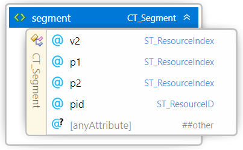

##### Attributes

| Name | Type | Use | Default | Annotation |
| --- | --- | --- | --- | --- |
| v2 | **ST\_ResourceIndex** | required | | References a zero-based index into the vertices for this slice. Defines the second vertex of the segment. |
| p1 | **ST\_ResourceIndex** | | | Overrides the slice-level pindex for the first vertex of the segment, which is v2 from the previous segment or startv from the parent polygon. |
| p2 | **ST\_ResourceIndex** | | | Overrides the slice-level pindex for the second vertex of the segment |
| pid | **ST\_ResourceID** | | | Overrides the slice-level pid for the segment. |

A \<segment> element represents a single line segment (or edge) of a polygon. It runs from the vertex specified by the previous segment (or the startv \<polygon> attribute for the first segment) to the specified vertex, v2.

As described above, the polygon is closed only if the final segment vertex "v2" is the same as startv.

The v2 attributes MUST be distinct from their immediate predecessor/successor segments. Consumers MUST be able to consume line segments with zero or near-zero length.

The property p1 is applied to the beginning of the segment, while p2 applies to the end vertex "v2". These properties allow property gradients to be defined across the segment, where interpolation of the property is defined as the linear convex combination.

A consumer that cannot create property gradients MUST apply the p1 property to the entire segment. A consumer that cannot use properties on a per-segment basis MUST ignore the segment properties and use the \<object> level property instead. If p1 is not specified, then no properties are assigned to the segment. If p2 is unspecified then p1 is used for the entire segment.

The property group is specified by the pid attribute, if different than the property group defined at the object-level. Since this is applied to the whole segment, it implicitly forces the two properties to be from the same group, which implies they are of the same type, as defined in the core 3MF specification.

Producers MUST NOT reference images, e.g. by referencing a \<texture2dgroup> property type.

In order to avoid integer overflows, a polygon MUST contain less than 2^31 segments.

# Part II. Appendixes

## Appendix A. Glossary

See [the 3MF Core Specification glossary](https://github.com/3MFConsortium/spec_core/blob/master/3MF%20Core%20Specification.md#appendix-a-glossary).

## Appendix B. 3MF XSD Schema

```xml
<?xml version="1.0" encoding="UTF-8"?>
<xs:schema xmlns="http://schemas.microsoft.com/3dmanufacturing/slice/2015/07" xmlns:xs="http://www.w3.org/2001/XMLSchema" xmlns:xml="http://www.w3.org/XML/1998/namespace" targetNamespace="http://schemas.microsoft.com/3dmanufacturing/slice/2015/07" elementFormDefault="unqualified" attributeFormDefault="unqualified" blockDefault="#all">
    <xs:import namespace="http://www.w3.org/XML/1998/namespace" schemaLocation="http://www.w3.org/2001/xml.xsd"/>
    <xs:annotation>
        <xs:documentation><![CDATA[
        Schema notes:

        Items within this schema follow a simple naming convention of appending a prefix indicating the type of element for references:

        Unprefixed: Element names
        CT_: Complex types
        ST_: Simple types
        
        ]]></xs:documentation>
    </xs:annotation>
    <!-- Complex Types -->
    <xs:complexType name="CT_SliceStack">
        <xs:choice>
            <xs:element ref="slice" minOccurs="0" maxOccurs="2147483647"/>
            <xs:element ref="sliceref" minOccurs="0" maxOccurs="2147483647"/>
        </xs:choice>
        <xs:attribute name="id" type="ST_ResourceID" use="required"/>
        <xs:attribute name="zbottom" type="ST_Number"/>
        <xs:anyAttribute namespace="##other" processContents="lax"/>
    </xs:complexType>
    <xs:complexType name="CT_Slice">
        <xs:sequence>
            <xs:element ref="vertices" minOccurs="0" />
            <xs:element ref="polygon" minOccurs="0" maxOccurs="2147483647"/>
            <xs:any namespace="##other" processContents="lax" minOccurs="0" maxOccurs="2147483647"/>
        </xs:sequence>
        <xs:attribute name="ztop" type="ST_Number" use="required"/>
        <xs:anyAttribute namespace="##other" processContents="lax"/>
    </xs:complexType>   
    <xs:complexType name="CT_SliceRef">
        <xs:attribute name="slicestackid" type="ST_ResourceID" use="required"/>
        <xs:attribute name="slicepath" type="ST_UriReference" use="required"/>
        <xs:anyAttribute namespace="##other" processContents="lax"/>
    </xs:complexType>
    <xs:complexType name="CT_2DVertices">
        <xs:sequence>
            <xs:element ref="vertex" minOccurs="2" maxOccurs="2147483647"/>
        </xs:sequence>
    </xs:complexType>
    <xs:complexType name="CT_2DVertex">
        <xs:attribute name="x" type="ST_Number" use="required"/>
        <xs:attribute name="y" type="ST_Number" use="required"/>
        <xs:anyAttribute namespace="##other" processContents="lax"/>
    </xs:complexType>
    <xs:complexType name="CT_Polygon">
        <xs:sequence>
            <xs:element ref="segment" minOccurs="1" maxOccurs="2147483647"/>
        </xs:sequence>
      <xs:attribute name="startv" type="ST_ResourceIndex" use="required"/>
    </xs:complexType>
    <xs:complexType name="CT_Segment">
        <xs:attribute name="v2" type="ST_ResourceIndex" use="required"/>
        <xs:attribute name="p1" type="ST_ResourceIndex" use="required"/>
        <xs:attribute name="p2" type="ST_ResourceIndex" use="required"/>
        <xs:attribute name="pid" type="ST_ResourceID" use="required"/>
        <xs:anyAttribute namespace="##other" processContents="lax"/>
    </xs:complexType>
    <!-- Simple Types -->
    <xs:simpleType name="ST_Number">
        <xs:restriction base="xs:double">
            <xs:whiteSpace value="collapse"/>
            <xs:pattern value="((\-|\+)?(([0-9]+(\.[0-9]+)?)|(\.[0-9]+))((e|E)(\-|\+)?[0-9]+)?)"/>
        </xs:restriction>
    </xs:simpleType>
    <xs:simpleType name="ST_ResourceID">
        <xs:restriction base="xs:positiveInteger">
            <xs:maxExclusive value="2147483648"/>
        </xs:restriction>
    </xs:simpleType>
    <xs:simpleType name="ST_ResourceIndex">
        <xs:restriction base="xs:nonNegativeInteger">
            <xs:maxExclusive value="2147483648"/>
        </xs:restriction>
    </xs:simpleType>
    <xs:simpleType name="ST_UriReference">
        <xs:restriction base="xs:anyURI">
            <xs:pattern value="/.*"/>
        </xs:restriction>
    </xs:simpleType>
    <xs:simpleType name="ST_ColorValue">
        <xs:restriction base="xs:string">
            <xs:pattern value="#[0-9|A-F|a-f][0-9|A-F|a-f][0-9|A-F|a-f][0-9|A-F|a-f][0-9|A-F|a-f][0-9|A-F|a-f]([0-9|A-F|a-f][0-9|A-F|a-f])?"/>
        </xs:restriction>
    </xs:simpleType>
    <!-- Elements -->
    <xs:element name="slicestack" type="CT_SliceStack"/>
    <xs:element name="sliceref" type="CT_SliceRef"/>
    <xs:element name="slice" type="CT_Slice"/>  
    <xs:element name="vertices" type="CT_2DVertices"/>
    <xs:element name="vertex" type="CT_2DVertex"/>
    <xs:element name="polygon" type="CT_Polygon"/>
    <xs:element name="segment" type="CT_Segment"/>
</xs:schema>
```

## Appendix C. Standard Namespaces and Content Types

### C.1 Content Types

3D Model application/vnd.ms-package.3dmanufacturing-3dmodel+xml

### C.2 Relationship Types

3D Model http://schemas.microsoft.com/3dmanufacturing/2013/01/3dmodel

### C.3 Namespaces

Slice http://schemas.microsoft.com/3dmanufacturing/slice/2015/07

# References

See [the 3MF Core Specification references](https://github.com/3MFConsortium/spec_core/blob/master/3MF%20Core%20Specification.md#references).

Copyright 3MF Consortium 2018.
